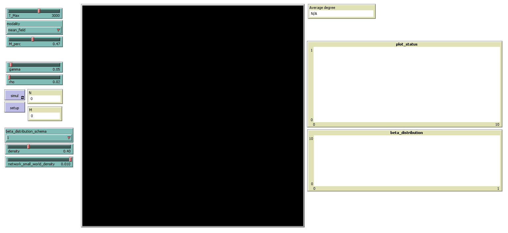

## abm_sir
an ABM SIR model with individual beta

The SIR model is one of the simplest compartmental models, and many models are derivatives of this basic form. 

The model consists of three compartments: 
S for the number of susceptible, I for the number of infectious, and R for the number of recovered or deceased (or immune) individuals. 
(This compartment may also be called "resistant" or "removed.")
This model is reasonably predictive[citation needed] for infectious diseases that are transmitted from human to human, 
and where recovery confers lasting resistance, such as measles, mumps and rubella.

We have seven different modality (topology)to trasmit infection:
Each agent can infect another agent (mean field)
Each agent can infect its eight (or four) immediate neighbors.
The infection is transmitted over a network, with 4 different topological structure:

One type of agent.
Each agent can be in one of three states (in the course of dynamics in general, each agent can change state several times): S (susceptible), I (infected), R (recovered).

Initial conditions: no agents R, M <N agents I, the rest susceptible.

Dynamics: divided into T_MAX time units (days, months, whatever you want); however, each time unit is made up of N elementary steps.

At each elementary step a random agent is extracted, let's call it k: if k is an S, 
one of its neighbors is extracted (i.e. any other agent if we are in the mean field, one of its 4 or 8 first neighbors in the other two),
 and if this neighbor is an I (infected), with probability BETA (see point 7) k becomes I too.

 update_infection - -

For the moment BETA is a fixed parameter of the model, but when we refine the model it will vary, over time and from agent to agent (how we will see it). If agent k is an I, two things are done: a) a neighbor is extracted (similarly to point 5), if this neighbor is an S, with probability BETA also this neighbor becomes I, b) then with probability GAMMA agent k becomes R.

Finally, if the agent k is an R, with probability RHO becomes S.

For clarity, I repeat that points 6-10 represent a single elementary step, N elementary steps make up a time unit, the whole simulation lasts T_MAX time units.

In summary: the parameters that the user can choose are BETA, GAMMA, RHO (which being probabilities go from 0 to 1, I would do it in steps of 0.05 or smaller); topology (mean field, 2D with 4 p.v., 2D with 8 p.v.) the initial M number of infected is also chosen by the user. N, on the other hand, is fixed, I will make 100 or 200 (you see, in general the more I am, the better, clearly if too many, then the dynamics are slow).

extensions [rnd csv]
turtles-own [status beta]
globals [N M beta_distribution beta_variance]

  __includes [ "beta_distribution_default.nls" ]

to setup
  clear-all
  set-beta
  set N int (((max-pxcor * 2 ) + 1) * ((max-pycor * 2 ) + 1) * density )
  set M int (N * M_perc)
  repeat N[
    ask one-of patches with[not any? turtles-here][
      sprout 1 [
        set size 0.8
        set shape "person"
        set status "S"
      ]
    ]
  ]
  ask n-of M turtles[
    set status "I"
  ]
  ask turtles [
    set beta random-normal (first rnd:weighted-one-of-list beta_distribution [ [p] -> last p ]) beta_variance
    set beta (max (list beta 0))
    set beta (min (list beta 1))
  ]
  if modality = "network_small_world"[
    let i 0
    repeat (N - 1)[
      ask turtle i [create-link-with turtle (i + 1)]
      set i i + 1
    ]
    ask turtle (N - 1) [create-link-with turtle 0]
    ask turtles [
      let targets other turtles with [ not (link-neighbor? myself)]
      if any? targets [
        ask n-of (int (network_small_world_density * (count targets))) targets [
          create-link-with myself
        ]
      ]
    ]

  ]
  draw_all
  reset-ticks
end

to update [status_to_test  x prob]
  if (status_to_test = "I") and ([status] of x) = status_to_test and (random-float 1) < prob[
            set status "I"
          ]
  if (status_to_test = "S") and ([status] of x) = status_to_test and (random-float 1) < prob[
            ask x [set status "I"]
          ]
end

to update_infected [status_to_test myprob]
        if modality = "mean_field"[
          let x one-of other turtles
          let prob sqrt (myprob * [beta] of x)
          update status_to_test x prob
        ]
        if modality = "4neigh"[
          let y turtles-on neighbors4
          if any? y[
           let x one-of y
           let prob sqrt (myprob * [beta] of x)
           update status_to_test x prob
          ]
        ]
        if modality = "8neigh"[
          let y turtles-on neighbors
          if any? y[
           let x one-of y
           let prob sqrt (myprob * [beta] of x)
           update status_to_test x prob
          ]
        ]
        if modality = "network"[
          let y link-neighbors
          if any? y[
           let x one-of y
           let prob sqrt (myprob * [beta] of x)
           update status_to_test x prob
          ]
        ]
end

to simul
  if ticks = T_Max [stop]
  repeat N [
    let k one-of turtles
    ifelse [status] of k = "S"
    [
      ask k[
        update_infected "I" beta
      ]
    ]
    [
      ifelse [status] of k = "I"
      [
       ask k[
          update_infected "S" beta
          if (random-float 1) < gamma[
            set status "R"
          ]
        ]
      ]
      [
        ask k [if (random-float 1) < rho [set status "S"]]
      ]
    ]
  ]
  draw_all
  tick
end

to draw_all
  ask turtles[
    if status = "I" [set color red]
    if status = "S" [set color blue]
    if status = "R" [set color green]
  ]
  if modality = "network_small_world" [layout-circle sort turtles 15]
end

to compute_stats
end
